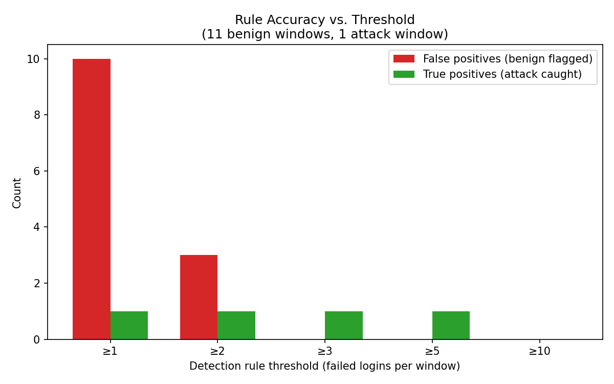

# Signal vs Noise

**Measuring alert false-positive rates in a live Splunk SIEM deployment.**

A hands-on lab investigating *alert fatigue* — the well-known problem where SOC analysts are flooded with false-positive alerts until they start ignoring real ones. Instead of just describing the problem, this project builds a real detection pipeline, generates real attack and benign traffic, and measures exactly where a simple brute-force detection rule starts generating noise versus catching the real thing.

> 📄 Full write-up (methodology, results, legal considerations): [`report/Signal_vs_Noise_Research_Assignment.pdf`](report/Signal_vs_Noise_Research_Assignment.pdf)

---

## TL;DR

- Built a real **Splunk Enterprise + Universal Forwarder** pipeline, ingesting live SSH authentication logs from a Kali Linux VM.
- Generated a genuine **Hydra brute-force attack** and a set of **realistic benign login failures** (mistyped passwords, abandoned attempts, typo'd usernames).
- Measured false-positive rate at several detection thresholds.
- Found that a naive rule (flag on **any** failed login) was wrong **91% of the time**. Tuning the threshold to **≥3 failed attempts per minute** eliminated every false positive in the dataset while still catching the real attack.

| Threshold | False positives (of 11 benign windows) | Attack caught? |
|---|---|---|
| ≥ 1 | 10 (91%) | positive |
| ≥ 2 | 3 (27%) | positive |
| **≥ 3** | **0 (0%)** | positive |
| ≥ 10 | 0 (0%) | negative |



---

## Why this project

Most SOC/SIEM tutorials stop at "install the tool, trigger one alert, done." This project instead asks a sharper question: **how noisy is a detection rule actually, and what does it take to fix that?** That's the real, daily work of a detection engineer — not just writing a rule, but testing it against both malicious *and* benign data before trusting it.

---

## Repo structure

```
.
├── report/                  Full research write-up (PDF + Word), charts
├── lab/
│   └── screenshots/         Evidence from every stage of the build
├── detection/
│   ├── failed_login_detection.spl   Splunk SPL queries used for analysis
│   └── brute_force_ssh.sigma.yml    Portable Sigma-format detection rule
└── scripts/
    ├── setup_forwarder.sh   Splunk Universal Forwarder install/config
    ├── run_trials.sh        Attack + benign traffic generation steps
    └── generate_charts.py   Python script that built the charts from lab data
```

---

## Lab architecture

```
┌─────────────────────────┐          ┌──────────────────────────┐
│   Kali Linux VM          │          │   Host machine            │
│   (attacker + victim)     │          │   Splunk Enterprise        │
│                            │  :9997  │   (indexer + dashboard)    │
│  Splunk Universal Forwarder│ ───────▶│  http://localhost:8000     │
│  monitors /var/log/auth.log│          │                            │
└─────────────────────────┘          └──────────────────────────┘
```

Both attacker and victim traffic used the loopback interface (`127.0.0.1`) on a single Kali VM — a deliberate scoping decision to keep the lab achievable while still producing authentic `sshd` log output. See the report's **Limitations** section for what this leaves untested (e.g. multi-source attacks).

---

## Method, in short

1. **Attack traffic:** [Hydra](https://github.com/vanhauser-thc/thc-hydra) brute-forced a dedicated low-privilege test account (`testvictim`) over SSH, using wordlists of varying size.
2. **Benign traffic:** manually generated realistic login failures — single mistyped passwords, forgetful multi-attempt logins, typo'd usernames — to mimic genuine human error rather than only testing against attack data.
3. **Detection:** an SPL query (`detection/failed_login_detection.spl`) aggregated failed logins into 1-minute windows per source IP.
4. **Analysis:** the same aggregation was tested at thresholds of 1, 2, 3, 5, and 10 to find the point where false positives disappeared without losing the real attack.

Full methodology, raw data tables, and discussion are in the report.

---

## Key finding

A single-failure threshold (the most "cautious" possible rule) is actually the **worst** choice — it generates a 10:1 noise-to-signal ratio in this dataset, which in a real SOC would train analysts to ignore the alert type entirely. A small, evidence-based tuning step (≥3 instead of ≥1) removed all observed noise with no loss of detection — a concrete, measurable illustration of why detection rules need testing, not just deployment.

---

## Tools used

`Splunk Enterprise` · `Splunk Universal Forwarder` · `Kali Linux` · `Hydra` · `VirtualBox` · `Python` (matplotlib, for charts)

---

## Author

**Syed Zabiullah Rehan Mehdi** — B.Tech Computer Science, Osmania University
Built as part of a college research assignment on cybercrime & digital forensics, and expanded for portfolio use.
